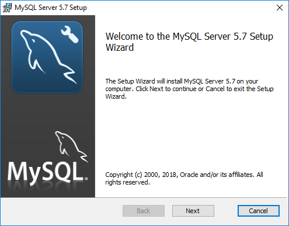
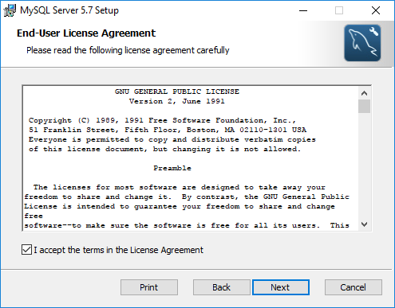
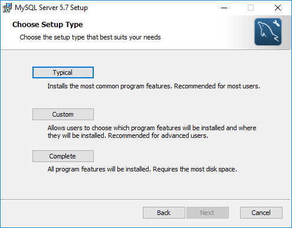
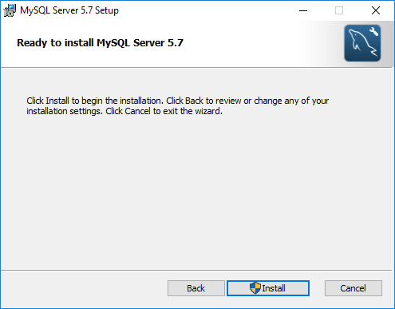
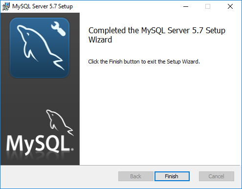

## Instalación de MySQL en Windows 10

La MySQL 5.7.23 requiere componentes de Visual Studio 2013 x64 Redistributable, que ya vienen instalados en Windows 10

MySQL es una de las bases de datos mas utilizadas por las diferentes aplicaciones desarrolladas en **PHP** como **WordPress**, **phpBB**, **vBulletin**, **Joomla**, **Drupal** entre otras.

Tras aceptar el acuerdo de licencia GPL v2, tenemos 3 tipos de instalación típica, completa y personalizada. Recomiendo instalar la versión **completa** ya que integra todos los componentes incluyendo el cliente por linea de comandos, documentacion con ejemplos y librerías de desarrollo.

La carpeta de instalación por defecto es **C:\Program Files\MySQL\MySQL Server 5.7\\** y bastara con presionar siguiente e instalar.

Al finalizar la instalación nos presenta la versión Entreprise que es de pago a modo de publicidad y presionamos siguiente para continuar.

Con esto concluimos la instalación de MySQL Server, sin embargo, aún no está configurada.

## Configuración de MySQL

Tras instalar el servidor de MySQL este aun no esta funcionando, por lo cual se deben seguir los siguientes pasos

1. Ejecutar la consola `cmd` como administrador

2. Entrar al directorio de MySQL 

~~~
C:\Program Files\MySQL\MySQL Server 5.7\
~~~

3. Crear la carpeta `data` y generar la clave inicial que tambien se encuentra en `data\[computer name].err`

~~~
bin\mysqld --initialize --console
~~~

~~~
[Note] A temporary password is generated for root@localhost: Fiy+ig3wq.vd
~~~

4. Para permitir el acceso de manera remota

~~~
bin\mysqld --skip-name-resolve --console
~~~

5. Para instalar de manera personalizada debemos remover la instalacion predeterminada `bin\mysqld --remove "MySQL Server"` e instalar con un archivo de configuracion 

~~~
bin\mysqld --install "MySQL Server"
~~~

~~~
 Service successfully installed.
~~~

6. Una vez instalado debemos correrlo como servicio, para detenerlo `NET STOP "MySQL Server"`

~~~
NET START "MySQL Server"
~~~

~~~
El servicio de MySQL Server está iniciándose..
El servicio de MySQL Server se ha iniciado correctamente.
~~~

7. Para validar

~~~
bin\mysql --user root --password
~~~

~~~
Enter password: ************
Welcome to the MySQL monitor.  Commands end with ; or \g.
Your MySQL connection id is 4
Server version: 5.7.23
~~~

### Regla de firewall

~~~
NETSH advfirewall firewall add rule name="MySQL Server 5.7" program="C:\Program Files\MySQL\MySQL Server 5.7\bin\mysqld.exe" protocol=TCP localport=3306 dir=in action=allow enable=yes
~~~

* Si existe algun problema durante la instalacion les puede dar seguimiento en el panel de eventos `Computer Management>Event Viewer>Custom Views>Summary page events`

## Referencias

* https://dev.mysql.com/doc/refman/5.7/en/server-options.html
* https://dev.mysql.com/doc/refman/5.7/en/data-directory-initialization-mysqld.html
* https://dev.mysql.com/doc/refman/5.7/en/multiple-windows-services.html

## Autores

* [Angel González](https://github.com/mgrc45)
* [Jorge Oyhenard](http://www.jorgeoyhenard.com/author/elQuique/)

## Licencia

Este proyecto está licenciado bajo la licencia GNU General Public License v2.0.
