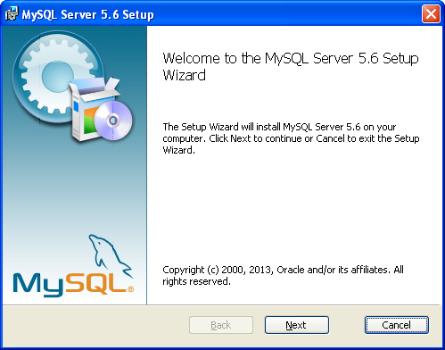
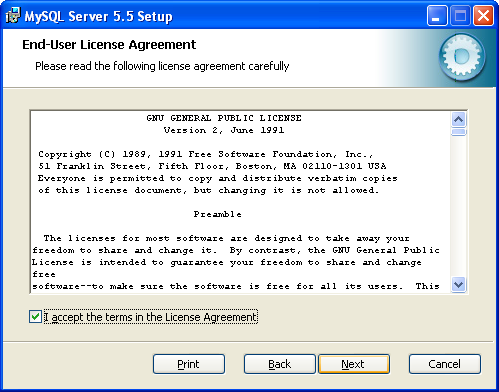
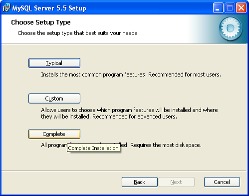
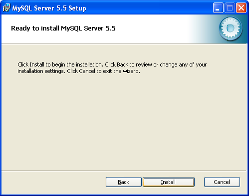
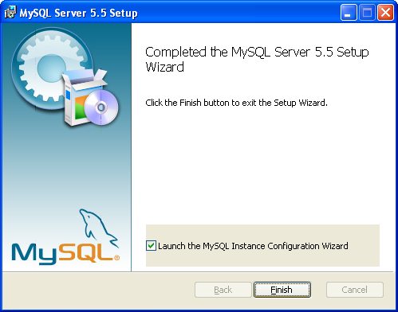

## Instalación de MySQL en Windows XP

MySQL es una de las bases de datos mas utilizadas por las diferentes aplicaciones desarrolladas en **PHP** como **WordPress**, **phpBB**, **vBulletin**, **Joomla**, **Drupal** entre otras.

Tras aceptar el acuerdo de licencia General Public License v2, tenemos 3 tipos de instalación típica, completa y personalizada. Esta última permite seleccionar el directorio de destino sin embargo, recomiendo instalar la versión **completa** ya que integra todos los componentes incluyendo ejemplos, scripts y librerías de desarrollo.

La carpeta de instalación por defecto es **[C:\Archivos de Programa\MySQL\MySQL Server 5.5\]** y bastara con presionar siguiente e instalar.

Al finalizar la instalación nos presenta la versión Entreprise que es de pago a modo de publicidad y presionamos siguiente para continuar.

Con esto concluimos la instalación de MySQL Server, sin embargo, aún no está configurada.

## Autores

* [Angel González](https://github.com/mgrc45)
* [Jorge Oyhenard](http://www.jorgeoyhenard.com/author/elQuique/)

## Licencia

Este proyecto está licenciado bajo la licencia GNU General Public License v2.0.
