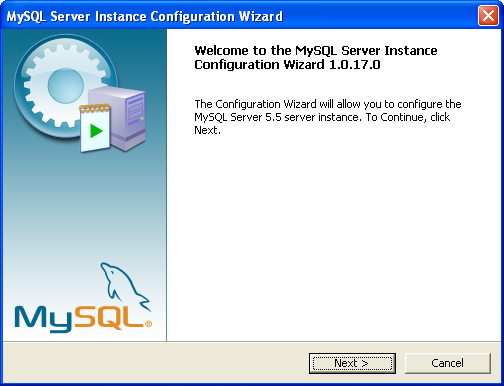
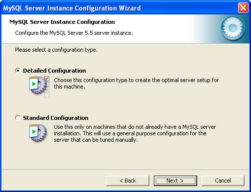
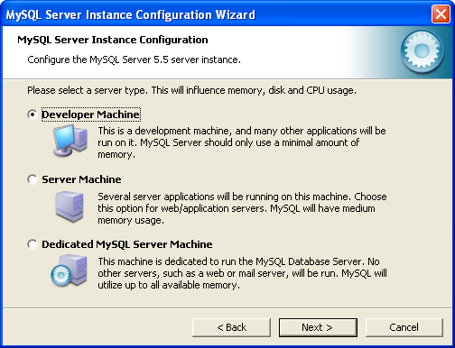
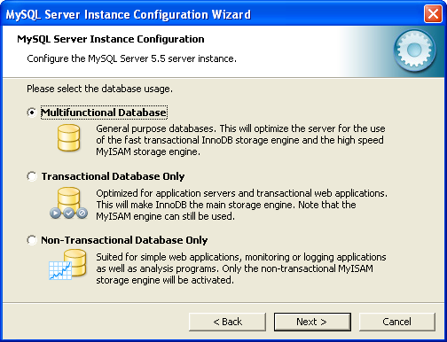
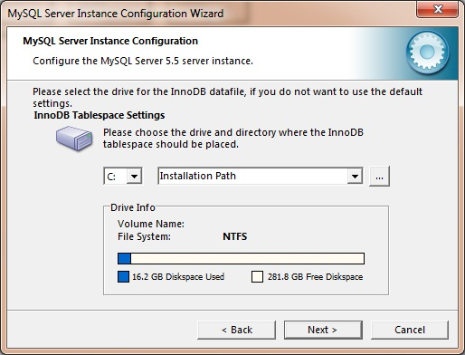
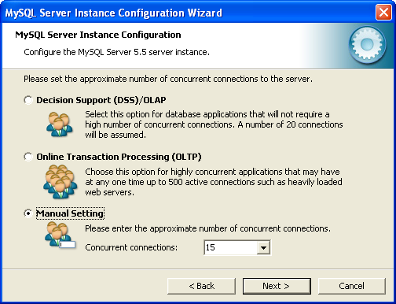
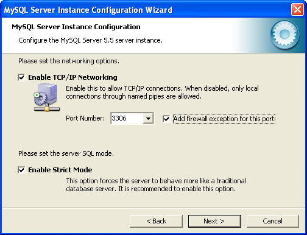
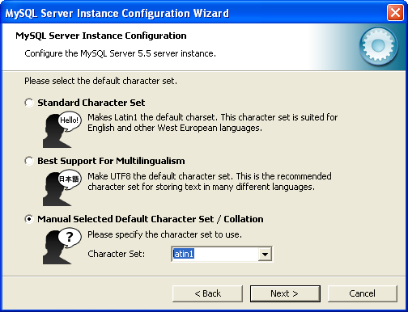
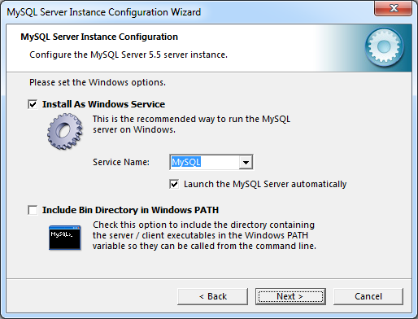
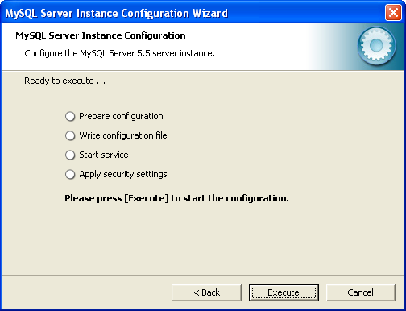

## Configuración de MySQL en Windows XP

por [Jorge Oyhenard](http://www.jorgeoyhenard.com/author/elQuique/) en [desarrollo aplicaciones](http://www.jorgeoyhenard.com/articulos/desarrollo-aplicaciones/), [desarrollo web](http://www.jorgeoyhenard.com/articulos/desarollo-web/) 
16 de April de 2010 05:30 am

En el asistente de configuraciones podemos decidir entre una configuración **detallada** o estándar. La instalación estándar agrega MySQL como un servicio Windows que se ejecuta automáticamente al iniciar, se debe utilizar en computadoras que no tengan instaladas MySQL.

Pero haremos la configuración detallada que por ser más precisa nos permite ahondar más en este artículo. En este punto de la configuración nos brinda tres formas posible:

* **Developer Machine**
Es la que vamos a utilizar nosotros como desarrolladores, ya que usaremos MySQL más que nada para testear nuestras aplicaciones. En esta opción MySQL Server se configura para utilizar un mínimo de recursos y memorias de forma de dejar parte del PC disponible para usarlo en otras aplicaciones.

* **Server Machine**
Recomendada cuando instalamos MySQL Server en un servidor donde existen otras aplicaciones en modo Servidor, por ejemplo Aplicaciones Web que se sirven de este mismo servidor. En este caso MySQL hace un uso intermedio de memoria y recursos.

* **Dedicated MySQL Server Machine**
Esta opción configura MySQL asumiendo que solo MySQL Server estará corriendo en este servidor, no deja lugar a que corran otras aplicaciones. En esta configuración MySQL utilizara toda la memoria y recursos disponibles.

Seleccionaremos en nuestro caso Developer Machine:

y presionamos siguiente. Ahora debemos definir el tipo de uso que se le dará a las bases de datos.

También se presenta tres opciones, debemos seleccionar una de ellas dependiendo del tipo de optimización que deseamos:

* **Multifunctional Database**
Define un propósito general, es la que seleccionaremos en nuestro caso para testing y desarrollo. Optimizara el servidor para transacciones rápidas en InnoDB y MyISAM.
* **Transactional Database Only**
Se optimiza para servidor de aplicaciones y aplicaciones web. Seleccionaremos esta opción si la aplicación que consume datos de MySQL está en producción y utiliza principalmente InnoDB, aunque también admite MyISAM aunque no lo beneficia.

* **Non-Transactional Database Only**
Optimo para aplicaciones web sencillas, de control o programas de análisis. Solo se activa el modelo no-transaccional MyISAM, por tanto no admite InnoDB.

En nuestro caso seleccionaremos Multifunctional Database.

La siguiente selección es la carpeta donde se almacenaran los datos, por defecto podemos usar una subcarpeta que se creará en el lugar de la instalación de MySQL, y continuamos con siguiente.

La cantidad de conexiones concurrentes al servidor es lo siguiente que debemos definir, si son hasta 20 conexiones seleccionamos Decision Support (DSS)/OLAP, en caso de requerir hasta 500 conexiones concurrentes seleccionamos Online Transaction Processing (OLTP), o en este caso como es para testing seleccionamos Manual Setting, y definimos el número de conexiones usando 5 o 10 conexiones.

La configuración de red es lo siguiente que debemos definir

La configuración de red es lo siguiente que debemos definir indicando su utilizaremos protocolo TCP/IP y el puerto, dejaremos los valores por defecto indicando el puerto 3306 y también marcando “Add firewall exception for this port” de forma de no tener problemas con el Firewall, y presionamos siguiente.

El juego de caracteres es lo siguiente a indicar

por defecto define Standard Character Set, o latin1, también conocido como iso-8859-1, pero la mayoría de los servidores web y aplicaciones como WordPress utilizan por defecto UTF8 ya que soporta mejor caracteres multilenguaje, la opción es Best Support For Multilingualism que seleccionaremos en este caso, la última opción Manual Selected Default Character Set / Collation nos permite seleccionar manualmente el Char Set.
Debemos indicar ahora que MySQL Server se ejecutar como un Servicio Windows (Install As Windows Service),

indicar un nombre de servicio, que dejaremos como MySQL, y marcaremos también la opción de incluir los archivos de ejecución de MySQL en el PATH de Windows (Include Bin Directory in Windows PATH) y continuamos con siguiente.
En este punto debemos prestar mucha atención

ya que es donde definimos el password del administrador principal del Servidor MySQL, o sea el usuario root. También podemos indicar si queremos que nuestras bases de datos se accedan desde maquinas remotas con el usuario root, y continuamos con siguiente.

hemos culminado con estos los pasos, presionamos Execute para que se termine de Instalar y Configurar MySQL. Presionamos Finish cuando aparezca el mensaje final de instalación.

En el menú inicio podemos ejecutar nuevamente el Asistente de Configuración de Instancias MySQL (MySQL Server Instance Config Wizard) en caso que sea necesario.

Ahora ya podemos utilizar MySQL desde nuestras aplicaciones PHP, .NET, y otras.

Error 1045 o problemas con Firewall al final de la instalación

Actualización 08/12/2010

En los comentarios de este blogs y algunos foros suelen comentarme sobre un error al final de la instalación o específicamente el error 1045. Al parecer la solución es sencilla pero es un poco difícil de darse cuenta.

Para como error nos confunde con un mensaje nos lleva a verificar el Firewall, y como sucede cuando vamos a configurar la instancia y nos pregunta el puerto y usuario para MySQL, salimos corriendo a ver el Firewall.

Afortunadamente el error me sucedió ayer por primera vez, luego de cientos de veces de instalar MySQL sin problemas, pero gracias a ese errror ahora tengo para contarles.

El error sucede cuando ya teniamos una instancia o datos en la carpeta de MySQL, ya sea por una instalación anterior o bien la actual que fallo por X causa, lo más sencillo si no tenemos datos o ninguna base de datos, es eliminar la carpeta DATA y luego configurar la instancia desde cero, con eso listo solucionado el problema.
Solución para curiosos:

Si tienes tiempo y ganas, como fue mi caso y quieres reproducir el problema solo para ver cual era el fallo, veamos la solución larga: Al intentar instalar sobre una Instancia previa o una carpeta con datos existente se puede producir este fallo aun cuando brindamos el password root anterior.
Incluso la forma de saber si fallará es: 

a) cuando es una instalación limpia, el wizard solicita password y confirmación, 
b) si es una instalación sobre una instancia existente, solicita password anterior, nuevo password y confirmación. 

En el caso B es cuando se produce el error.

El problema es que aun conociendo el password anterior seguirá dando el error 1045 y ahí justo está lo que nos hace perder tiempo, ya que carece de sentido.

La solución en este caso es eliminar la tabla de permisos antigua, re-asignar un password y realizar la configuración de instancia nuevamente. Vamos paso a paso:
* Cuando da el error 1045, vamos a presionar SKIP y salir del Wizar de Configuración de Instancias
* Abrimos MySQL desde la línea de comandos:  mysql -u root -p  (Enter), nos pide password e ingresamos el anterior
* En el prompt de MySQL, abrimos la base MySQL:   mysql> use mysql
* Eliminamos los usuarios y permisos sobrante:  mysql> delete from user where host=”localhost” and user=”";
* Cambiamos el password: mysql> update user set password=password(“acaelnuevopassword”) wher user=”root”;
* Limpiamos el cache de Tablas: mysql> flush tables;
* Y el de permisos: mysql> flush privileges;
* Salimos de MySQL: mysql> quit

