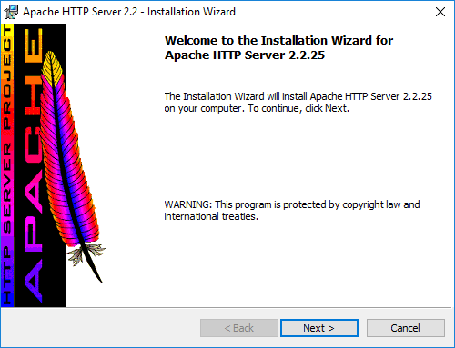
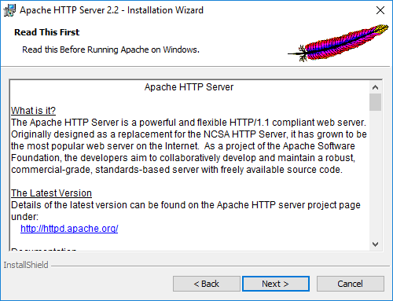
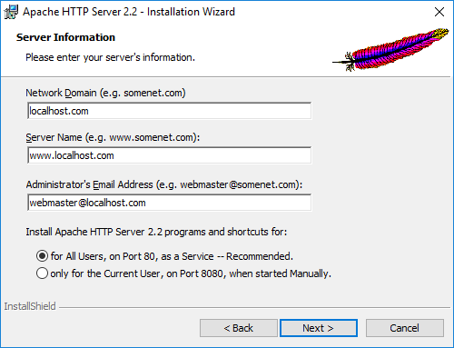
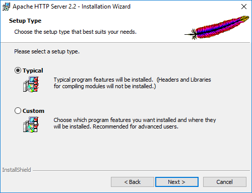
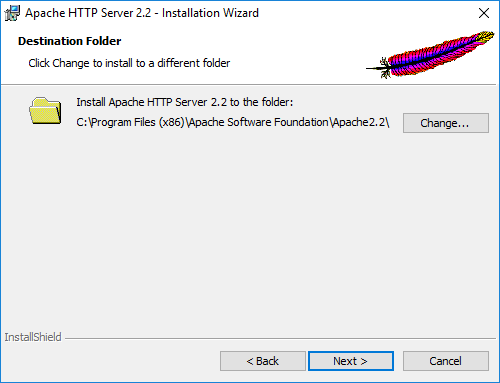
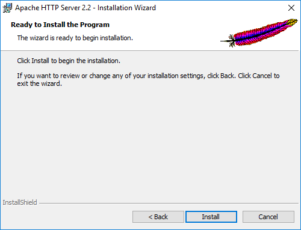
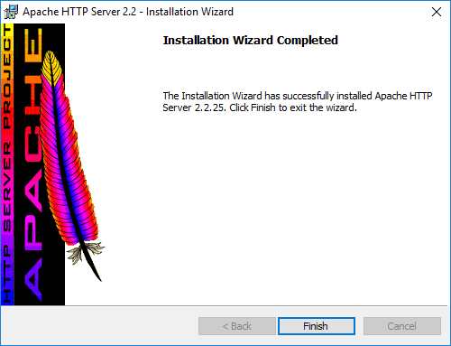

## Instalación de Apache en Windows 10

Apache es uno de los servidores web más utilizados por su estabilidad y desempeño. Es nativo en la mayoría de distribuciones de linux y de él se basan diferentes proyectos como **ApacheHaus**, **Apache Lounge**, **BitNami WAMP Stack**, **WampServer**, **XAMPP** entre otros.

## Descargar

* VC15: [Visual C++ Redistributable for Visual Studio 2017](https://go.microsoft.com/fwlink/?LinkId=746572)
* Paquete de Apache 2.4 compilado para windows [httpd-2.4.34-win64-VC15.zip](http://home.apache.org/~steffenal/VC15/binaries/httpd-2.4.34-win64-VC15.zip)

## Instalar

1. Creamos el directorio de Apache en windows `C:\Program Files\Apache\`

2. Descomprimimos el contenido del paquete `httpd-2.4.34-win64-VC15` en el directorio recien creado

3. Cambiar la ruta del servidor dentro del archivo de configuracion `C:\Program Files\Apache\conf\httpd.conf`

~~~
Define SRVROOT "C:/Program Files/Apache"
~~~

4. Ejecutar la consola `cmd` como administrador

5. Entrar al directorio de Apache `C:\Program Files\Apache\`

6. Instalar el servidor de apache como servicio de windows, en caso de desear desinstalar puede usar `bin\httpd.exe -k uninstall`

~~~
bin\httpd.exe -k install -n "Apache Server"
~~~

3. Renombramos `php.ini-development` por `php.ini`

4. Agregamos la siguiente linea en el archivo `C:\Program Files (x86)\Apache Software Foundation\Apache2.2\conf\httpd.conf`

Descarga el paquete de instalación para windows del servidor [apache 2.2.25](http://archive.apache.org/dist/httpd/binaries/win32/httpd-2.2.25-win32-x86-openssl-0.9.8y.msi).

Acepta el acuerdo de licencia Apache License v2.0, para continuar con la instalación

Se mostrará un texto informativo con las características de apache

Te pedirá llenar algunos campos, el contenido no afecta a la instalación

Recomiendo instalar la versión **tipica** ya que no requerimos el uso de librerías de compilación

La carpeta de instalación por defecto es **C:\Program Files (x86)\Apache Software Foundation\Apache2.2\\** y bastara con presionar siguiente e instalar

Durante el proceso de instalación el software nos abrirá varias ventanas de consola que no nos deben de preocupar

Con esto concluye la instalación del servidor web apache en windows, sin embargo recomiendo ampliamente configurarlo por motivos seguridad

**Referencias**
* http://www.apachelounge.com/download/
* http://httpd.apache.org/download.cgi
* http://archive.apache.org/dist/httpd/binaries/win32/
* http://httpd.apache.org/docs/2.2/platform/windows.html
* https://httpd.apache.org/docs/current/platform/windows.html

## Autores

* [Angel González](https://github.com/mgrc45)

## Licencia

Este proyecto está licenciado bajo la licencia GNU General Public License v2.0.
